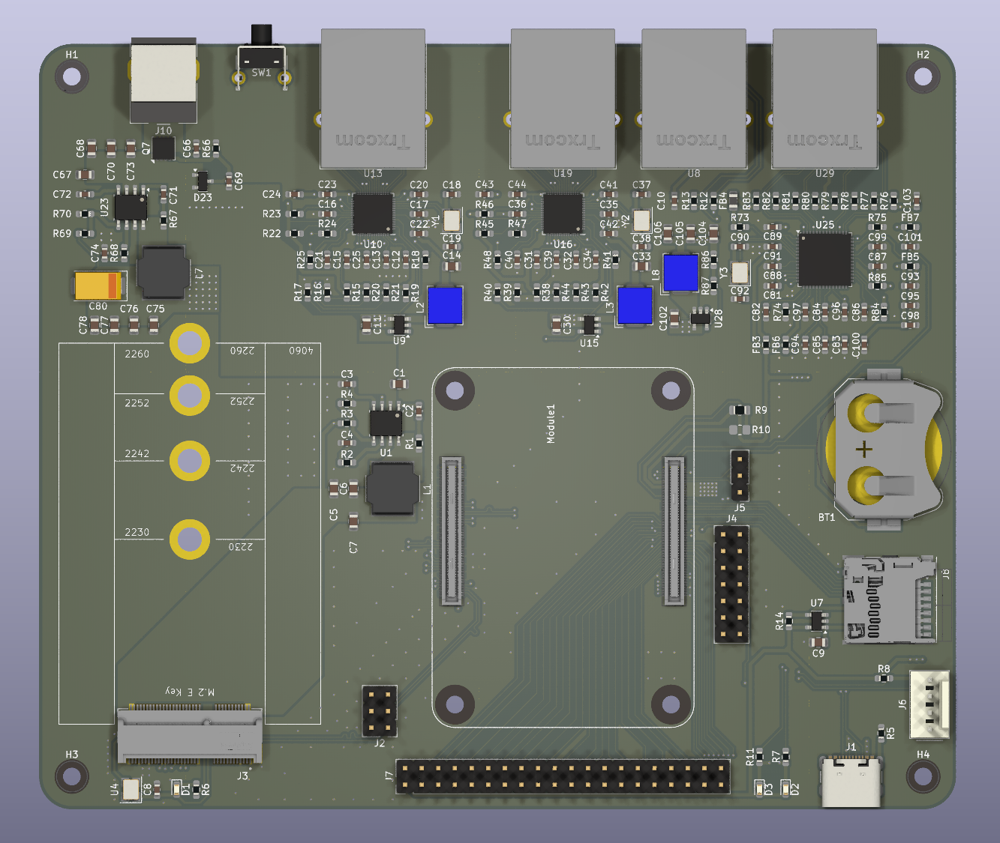
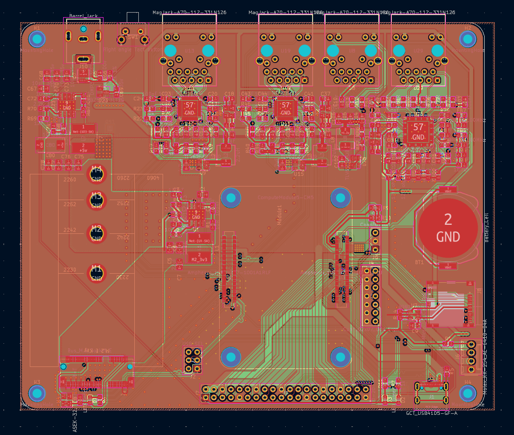

# RouterPi

A modular router development board based on the raspberry pi compute module 5.

Features:
- 2x 2.5G Ethernet Wan/Lan port
- 2x Gigabyte Ethernet Lan port
- M.2 E key connector for AP module
- RTC battery
- PWM fan connector
- SD card slot for compute module lite
- 12-24v input voltage

# Design constraints
- minimal track width: 0.127 mm
- minimal clearance: 0.125 mm
- minimal via hole diameter: 0.3 mm
- minimal via ring diameter: 0.45 mm
